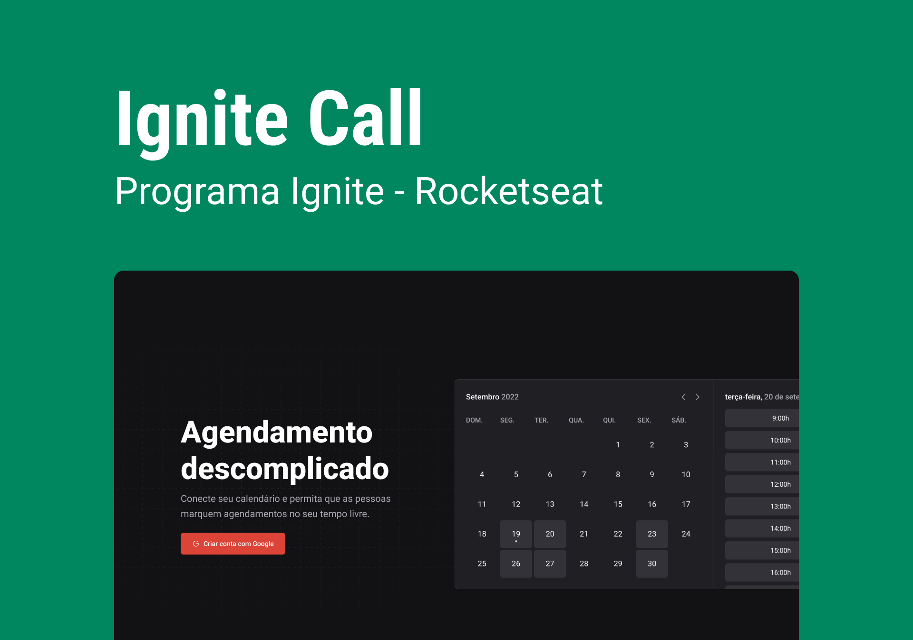

<span align="center">
    
</span>

O projeto Ignite Call foi construído para agendamentos de compromissos a partir de um calendário com integração com o Google Agenda. O usuário pode se cadastrar no app a partir de sua conta do Google e indicar seus dias da semana e horários em que estará disponível para agendar compromissos. Todo agendamento cadastrado na aplicação tem integração com o Google Agenda, o qeu possibilita ao usuário verificar seus novos compromissos direto na plataforma do Google.
O Ignite Call foi construído inteiramente em um projeto Next.js e utilizado os mecanismos fornecidos pelo framework para criação e integração do front-end e do back-end a partir de um único repositório de código. A comunicação da aplicação com o banco de dados foi feita com o uso da ferramenta Prisma.io e utilizado um banco de dados MySQL. O banco de dados de produção foi publicado a partir do serviço da plataforma PlanetScale e foi utilizado o serviço da Vercel para hospedagem da aplicação.

## 🛠️ Construído com

Esse projeto foi desenvolvido com as seguintes tecnologias:

- [Next](https://nextjs.org/)
- [ReactJS](https://reactjs.org)
- [TypeScript](https://www.typescriptlang.org/)
- [Stitches](https://stitches.dev/)
- [Stripe](https://stripe.com/)
- [Google APIs](https://cloud.google.com/apis)

### 📋 Pré-requisitos

Para clonar e rodar essa aplicação, será necessário o [Git](https://git-scm.com) e o [Node.js](https://nodejs.org/en/) instalados no seu computador além de configurar um arquivo `.env` contendo as informações conforme o `.env.example`.

### 🔧 Como usar

```bash
# Clone este repositório
$ git clone https://github.com/guispati/ignite-call.git

# Abra a pasta criada
$ cd ignite-call

# Instale as dependências
$ npm install

# Inicie o projeto
$ npm run dev
```

## 💻 Demonstração

O projeto pode ser executado pela URL https://ignite-call-nine.vercel.app/

## 📄 Licença

Este projeto está sob a licença MIT - veja o arquivo [LICENSE.md](LICENSE.md) para mais detalhes.

---
⌨️ com ❤️ por [Guilherme Spati](https://github.com/guispati) 😊